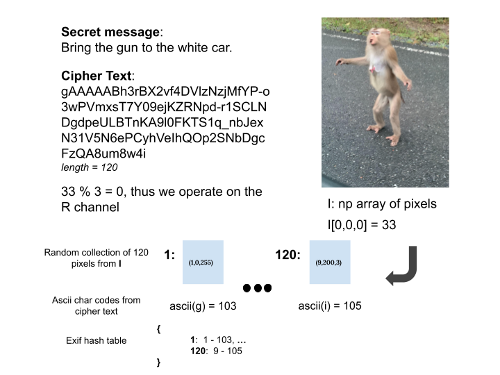

# Hide-Text-In-Image

This is a simple project that I developed for a high school computer science class.  In this project I embed an encrypted message into an image by using an image's pixel data and its exif data.  The encryption scheme is simple and effective enough to hide information from the computer illiterate.  

<figure>  
</img>
<figcaption><b>Fig 1. </b>Hide Text in Image encryption protocol.  Embedding encrypted data inside of an image of a monkey we saw at เขาใหญ่.</figcaption>
</figure> 

## Encryption

0. Read an image as a <i>numpy</i> array <b>I</b>, and perturb the first pixel's R channel by a visually indiscernible random integer -> randint(0,3).

1. Get a secret message <b>msg</b> from the user.  This program supports text file upload or manual 
entry of the secret message.

2. Encrypt the secret message (AES128 in CBC mode with a SHA256 HMAC message authentication code) using the <i>cryptography</i> module.

3.  Generate a random sample <b>S</b> (of length = len(msg)) of the image's (x, y) coordinates.  Create a hash table with each (xi, yi) in <b>S</b> as the key and <b>I</b>[0,0,0] mod 3 color channel value minus the ascii character code of msg[i] as the value.  This dictionary is stored in the image's exif data, specifically the <i>MakerNote</i>.

4. Add some random stuff to the hash table placed in the <i>MakerNote</i> such as <i>public-key</i>,<i>private-key</i>, and <i>seed</i>.  These meaningless key-values are used to further obfuscate.

5. Save the output image.  It is critical to use a lossless image format such as <i>png</i>.  Lossy file types can result in perturbed pixel values and information loss.  

6. Pickle the ferenet class used for encryption, and find a secure way of sending it to the reciever of the secret message.  Obviously you should not send the pickle file with the image (don't send the lock and key together).

## Decryption

0. Read the image containing encrypted data.  Extract the dictionary stored in the exif <i>MakerNote</i>.  Additionally read the image's pixel data as a numpy array.  

1. Extract the encrypted message by using the dictionary stored in the <i>MakerNote</i> in conjunction with the image's pixel data.

2. Use the <i>key.pickle</i> file to decrypt the cipher text

## Dependencies
<ul>
<li>python 3.8</li>
<li>numpy</li>
<li>piexif</li>
<li>cryptography</li>
</ul>

## Usage

(1) Decryption

<code>
py -3.8 encrypt.py --input (fname).png  
</code> 

*Note this assumes you have the key.pickle file in the current directory.  (fname) is the name of the png file containing encrypted data.

(1) Encryption

<code>
py -3.8 encrypt.py --write --input (fname).png  --output (oname).png
</code> 

*(fname) is the name of the png file that you would like to embed encrypted data. (oname) is the name of the output file with encrypted data

*After you run in encryption mode, you will also generate a <i>key.pickle</i> file.  This file is used by the recipient to decrypt the message. Technically the recipient would also need to be able to run this python file.